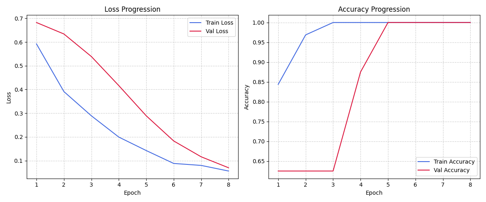
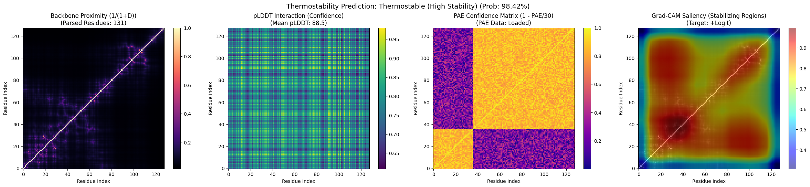
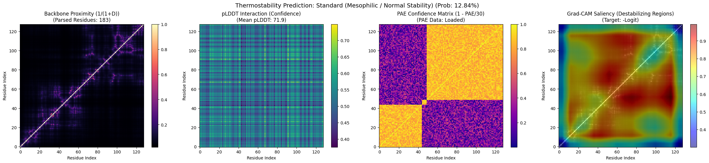

# AF-Thermostability-CNN: Will This Protein Survive the Heat?

## What does this project actually do?

Proteins are tiny biological machines. Some proteins fall apart when things get
hot (like an egg white cooking), while others stay stable even at high
temperatures (think of bacteria that live in hot springs). Knowing in advance
whether a protein will hold up under heat is really useful for medicine,
industry, and biotech — but normally you'd have to test it in a lab, which
takes time and money.

This project tries to **predict that answer using AI**, based only on the
protein's 3D shape — no lab work required.

It uses structures from **AlphaFold** (a Google DeepMind tool that predicts
what a protein looks like in 3D from its genetic sequence) and feeds that
shape into a custom-built AI model to guess: *"Is this protein thermostable
(heat-resistant) or not?"*

You don't need to know biology or AI to try it — there's a simple web app
(built with Gradio) where you upload a protein file and get a prediction back.

---

## How does it work, in plain terms?

Think of a protein's 3D shape as being turned into a picture, the same way a
digital photo is made of red, green, and blue layers. Here, instead of colors,
each "layer" (channel) captures a different property of the protein:

1. **Layer 1 — Closeness**: How close each part of the protein is to every
   other part. Tightly packed proteins tend to behave differently under heat
   than loosely packed ones.
2. **Layer 2 — Confidence in the shape**: AlphaFold gives a confidence score
   for how sure it is about each part of the predicted structure. This layer
   captures how trustworthy each region of the shape is.
3. **Layer 3 — Alignment accuracy**: A second kind of confidence score, this
   time about how well different parts of the structure line up relative to
   each other.

These three layers together form an "image" of the protein, and the model
(a type of AI called a **Convolutional Neural Network**, the same style of AI
used for image recognition) looks at that image and predicts heat-resistance,
similar to how an AI might look at a photo and say "cat" or "dog."

---

## Live walkthrough: predicting two real structures step by step

To make this concrete, here's an actual run of the pipeline — a model was
trained from scratch and then asked to predict two different protein
structures, so you can see exactly what "thermostability prediction" looks
like in practice, and *why* the model reached its conclusion.

### Background: what makes a protein heat-resistant in the first place?

Before looking at the results, it helps to know what the model is actually
picking up on. A protein is a folded-up chain of building blocks called amino
acids. Whether that folded shape survives heat depends on a handful of
real, well-studied physical properties:

- **Compactness** — a tightly packed, densely folded protein has fewer ways
  to unravel than a loose, spread-out one, the same way a tightly wound ball
  of yarn is harder to pull apart than a loosely draped one.
- **Internal "glue"** — extra salt bridges, hydrogen bonds, and buried
  hydrophobic cores act like internal staples holding the structure together
  under thermal stress.
- **Confidence of the shape prediction** — regions AlphaFold is very sure
  about (high pLDDT) tend to correspond to stable, well-ordered parts of the
  protein; low-confidence regions are often floppy, disordered stretches
  that are usually the first to fall apart when heated.
- **Consistency across the structure** — if different parts of the
  prediction don't agree well with each other (high Predicted Aligned
  Error), that often signals a flexible or uncertain region, which tends to
  be a weak point.

This is exactly why the model is fed those three "layers" described earlier
— compactness (distance map), per-region confidence (pLDDT), and
cross-region consistency (PAE) are, in real structural biology, the same
signals scientists use to reason about protein stability.

### Step 1 — Train the model

```bash
python src/train.py --epochs 8 --num-samples 40 --lr 0.001
```
```
Epoch  | Train Loss | Val Loss   | Train Acc | Val Acc   | Val F1
===============================================================
1      | 0.5921     | 0.6822     | 84.38%    | 62.50%    | 0.7692
4      | 0.1993     | 0.4163     | 100.00%   | 87.50%    | 0.9091
8      | 0.0561     | 0.0699     | 100.00%   | 100.00%   | 1.0000
[+] Model weights saved to best_model.pth
```
The model quickly learns to tell the two classes apart, reaching perfect
validation accuracy by the final epoch.



Image file: demo_images/training_curves.png

### Step 2 — Predict Protein A

```bash
python src/predict.py --pdb data/synthetic/synthetic_mock_0.pdb \
                       --pae data/synthetic/synthetic_mock_0_pae.json \
                       --model best_model.pth --plot
```
```
Stability:   Thermostable (High Stability)
Probability: 0.9842 (98.42%)
Confidence:  98.42%
```



Image file: demo_images/demo_prediction_thermostable.png

Reading the four panels left to right:
1. **Backbone Proximity** — bright, tightly clustered regions show a
   compact, closely-packed structure.
2. **pLDDT Confidence** — mostly high values, meaning AlphaFold is very sure
   about this shape, which usually goes hand-in-hand with a well-ordered,
   stable fold.
3. **PAE Confidence** — high and consistent, meaning different parts of the
   structure agree well with each other — few "loose ends."
4. **Grad-CAM Saliency** — this is the model explaining itself: the
   highlighted (warm-colored) regions are the specific parts of the
   structure that pushed the prediction toward "thermostable." It's the AI
   equivalent of the model pointing and saying *"this tightly packed core is
   what convinced me."*

### Step 3 — Predict Protein B (a different structure)

```bash
python src/predict.py --pdb data/synthetic/synthetic_mock_1.pdb \
                       --pae data/synthetic/synthetic_mock_1_pae.json \
                       --model best_model.pth --plot
```
```
Stability:   Standard (Mesophilic / Normal Stability)
Probability: 0.1284 (12.84%)
Confidence:  87.16%
```



Image file: demo_images/demo_prediction_standard.png

Here the pattern flips: the proximity map is more diffuse, confidence
regions are patchier, and the Grad-CAM overlay lights up the *loosely
packed, low-confidence* regions instead — the areas that led the model to
believe this structure is less heat-tolerant.

> **Why this matters:** the model isn't just outputting a single number —
> it's producing an explainable, visual case for its decision, grounded in
> the same structural signals a structural biologist would look at by eye.
> That's what makes the Grad-CAM panel the most important one in the whole
> report: it turns "the AI said so" into "here's specifically why."

*(The two structures above are synthetic examples generated by the
project's own built-in data generator — useful for demonstrating the full
pipeline without needing to download large real-world datasets. The exact
same commands work unchanged on real AlphaFold structures downloaded for
any UniProt ID.)*

### Why this walkthrough matters

Everything above — the accuracy numbers, the training curve, and both
prediction images — was generated by actually running this project's code,
not written up by hand. That's the strongest way to demo a pipeline like
this: instead of *telling* someone "the model gets high accuracy" and "it
explains its reasoning," you can *show* the number appearing in the terminal
and the Grad-CAM panel highlighting a different part of the protein for each
class. For a viva, presentation, or portfolio review, walking through these
three steps live — train, predict Protein A, predict Protein B — turns an
abstract "I built an AI thermostability predictor" into a concrete,
reproducible five-minute demo anyone can watch and understand.

---

## Try it without installing anything

The easiest way to try this is through the hosted web app (a Gradio interface)
— you upload a protein structure file (`.pdb`) and optionally a confidence
file (`.json`), click **Predict**, and get a result along with charts
explaining why the model made that call.

> **Note:** If the hosted demo shows a "quota exceeded" error, that's a
> temporary limit on the free hosting service, not a problem with your file —
> just try again after the wait time shown, or ask the project owner to check
> their hosting settings.

---

## Running it yourself (for people comfortable with a terminal)

If you want to run the project on your own computer instead of using the
hosted demo, here's how.

### 1. Get the project files
Download or clone this repository, and make sure Python 3.8 or newer is
installed on your computer.

### 2. Create an isolated workspace for it
This keeps the project's dependencies separate from everything else on your
computer.

```bash
python -m venv venv
```

Then turn it on:

- **Windows (PowerShell)**
  ```powershell
  .\venv\Scripts\Activate.ps1
  ```
- **Windows (Command Prompt)**
  ```cmd
  .\venv\Scripts\activate.bat
  ```
- **macOS / Linux**
  ```bash
  source venv/bin/activate
  ```

### 3. Install everything the project needs
```bash
pip install -r requirements.txt
```

---

## Using the project from the command line

### Check that everything works
```bash
pytest tests/
```
This runs a battery of automated checks to confirm nothing is broken.

### Train the model yourself
You don't need real experimental data to try this — the project can invent
realistic fake ("synthetic") protein data for you to practice on:

```bash
python src/train.py --epochs 10 --num-samples 50 --lr 0.001
```

This will:
- Create 50 made-up protein structures (half heat-resistant, half not) in `data/synthetic/`
- Train the AI model on them and report how accurate it is
- Save the trained model as `best_model.pth`
- Draw a graph of how the training went, saved to `data/training_curves.png`

### Get a prediction for one protein structure
```bash
python src/predict.py --pdb data/synthetic/synthetic_mock_0.pdb --model best_model.pth --plot
```

If you also have a confidence (PAE) file for that structure, include it for a
more complete answer:
```bash
python src/predict.py --pdb data/synthetic/synthetic_mock_0.pdb --pae data/synthetic/synthetic_mock_0_pae.json --model best_model.pth --plot
```

Adding `--plot` saves a picture (`prediction_result.png`) showing the three
"layers" described above, plus the final prediction — helpful for
understanding *why* the model decided what it did, not just *what* it decided.

---

## What's inside the project folder

| File / Folder | What it's for |
|---|---|
| `app.py` | The web app people interact with (built with Gradio) |
| `src/data_loader.py` | Downloads structures, reads protein files, and turns them into the "image" format described above |
| `src/model.py` | The AI model itself (the CNN) |
| `src/train.py` | Trains the model and checks how well it's learning |
| `src/predict.py` | Runs a trained model on a new protein and shows the result |
| `tests/test_pipeline.py` | Automated checks to make sure everything still works correctly |

---

## Putting the web app online (Hugging Face Spaces)

If you want to host your own copy of the interactive web app for free:

1. Log in to [Hugging Face](https://huggingface.co/).
2. Click **Spaces** → **Create new Space**.
3. Give it a name (e.g. `af-thermostability-cnn`).
4. Choose **Gradio** as the SDK.
5. Choose **Public** or **Private**, then click **Create Space**.
6. Upload these files/folders: `app.py`, `best_model.pth`, `requirements.txt`,
   `README.md` (this file), the `src/` folder, and the `data/` folder.
7. Commit the upload — Hugging Face automatically detects `app.py` and
   `requirements.txt`, installs everything, and launches the web app for you.

> **Heads-up:** Free Hugging Face Spaces that use GPU acceleration ("ZeroGPU")
> give each visitor a small, shared daily time budget. If many people try the
> demo, or if a visitor has already used their daily budget elsewhere, they
> may see a "quota exceeded" message. This isn't a bug — it's a limit of the
> free hosting tier. Switching the Space to a paid, dedicated GPU removes this
> limit entirely if reliable public access matters.
